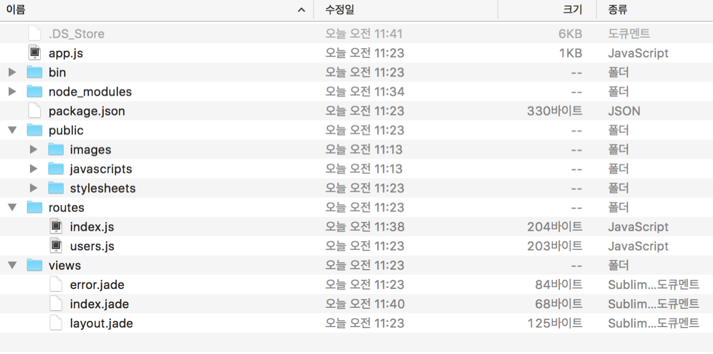
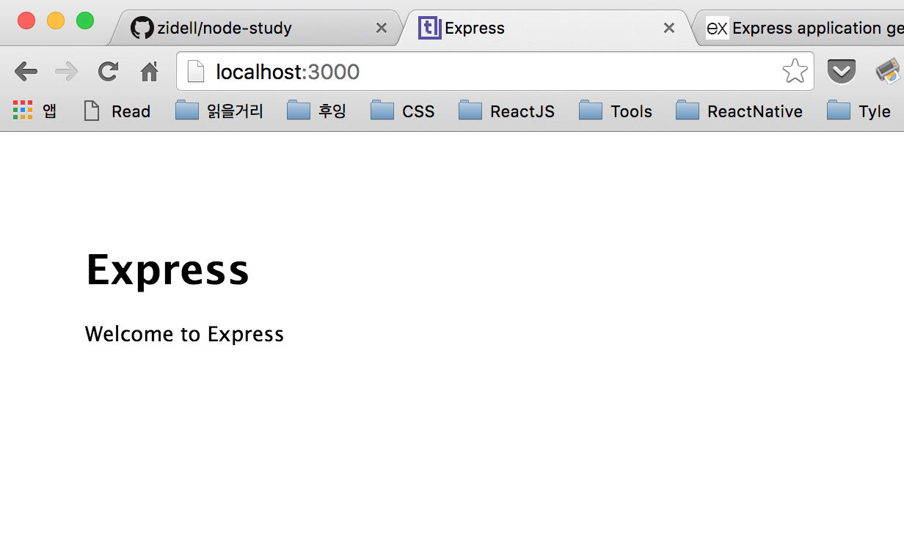
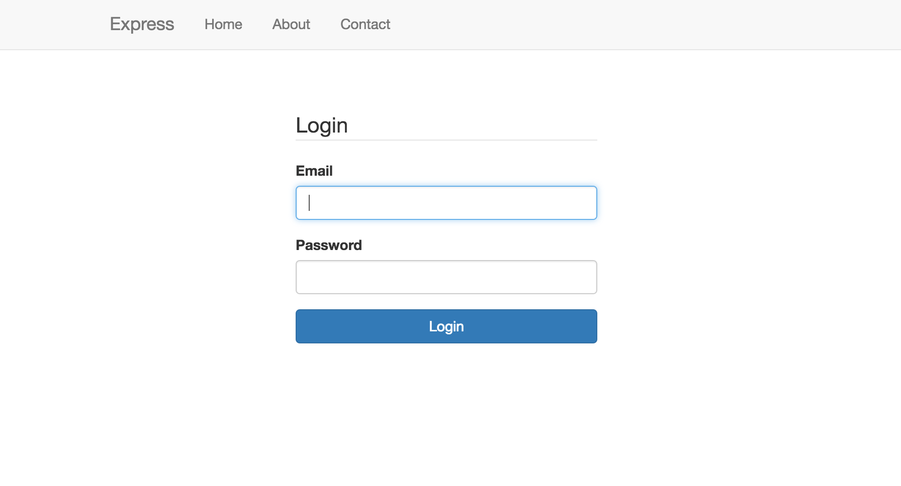
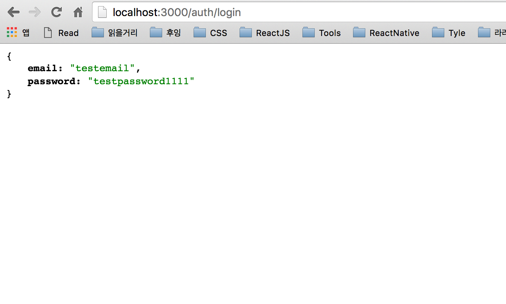

이전 : https://github.com/zidell/node-study/blob/master/week-10.md

이번 수업에서는 `express-generater`를 통한 기초 스케폴딩 생성, `handlebars`, `routes`, `mysql` 등을 활용해본다.

#express-generator
익스프레스를 쓸 때 권장할만한 기초적인 MVC가 들어가있는 거..
참고 : http://expressjs.com/en/starter/generator.html
```
$ npm install express-generator -g
```

#시작하기
간단하게 명령만 실행하면 기초적으로 필요한 것들이 설치된다. 설치 이후 `packages.json`에 정의된 모듈들이 설치되도록 `npm i`도 실행을 해준다. (윈도우의 경우에는 `set DEBUG=myapp:* & npm start`로 실행)
```
$ express testapp
$ npm i
$ DEBUG=myapp:* npm start
```
express기본구조

localhost:3000으로 접속하면 잘 뜬다


#몇 가지 안내(주석참고)
```javascript
// full app.js source
var express = require('express');
var path = require('path');
var favicon = require('serve-favicon');
var logger = require('morgan');
var cookieParser = require('cookie-parser');
var bodyParser = require('body-parser');

var routes = require('./routes/index'); // 라우트파일 읽어오기
var users = require('./routes/users'); // 라우트파일 읽어오기

var app = express();

// view engine setup
// app.set은 앱에서 필요한 설정을 하는 것, 아래에 나오는 app.use는 미들웨어
app.set('views', path.join(__dirname, 'views')); // view 폴더럴 설정, 
app.set('view engine', 'jade'); // 엔진설정. 갠적으로 핸들바를 선호하지만 귀찮으니까 기본설정에 따라보자.

// uncomment after placing your favicon in /public
//app.use(favicon(path.join(__dirname, 'public', 'favicon.ico')));
app.use(logger('dev'));
app.use(bodyParser.json());
app.use(bodyParser.urlencoded({ extended: false }));
app.use(cookieParser());
app.use(express.static(path.join(__dirname, 'public')));

// 이건 미들웨어를 설정해주는 것.
app.use('/', routes);
app.use('/users', users);

// catch 404 and forward to error handler
app.use(function(req, res, next) {
  var err = new Error('Not Found');
  err.status = 404;
  next(err);
});

// error handlers

// development error handler
// will print stacktrace
if (app.get('env') === 'development') {
  app.use(function(err, req, res, next) {
    res.status(err.status || 500);
    res.render('error', {
      message: err.message,
      error: err
    });
  });
}

// production error handler
// no stacktraces leaked to user
app.use(function(err, req, res, next) {
  res.status(err.status || 500);
  res.render('error', {
    message: err.message,
    error: {}
  });
});


module.exports = app; // 모듈로 내보냄
```

#라우트파일
걍 살펴보자ㅎㅎ
```javascript
// routes/index.js source
var express = require('express');
var router = express.Router();

/* GET home page. */
router.get('/', function(req, res, next) {
  res.render('index', { title: 'Express' });
});

module.exports = router;
```

#라우팅을 걸어보자.
`routes` 폴더에 `auth.js`를 만들어보자.
```javascript
var express = require('express');
var router = express.Router();

router.get('/login', function(req, res, next) { // app.js에서 auth에 이 라우팅을 걸어줄 것이기 때문에 /auth/login이 실제 URL이 된다.
  res.render('auth/login', { title: 'Login' });
});

module.exports = router;

```
그리고 app.js에서 연결을 해준다.
```javascript
// app.js
...
var routes = require('./routes/index');
var users = require('./routes/users');
var auth = require('./routes/auth'); // 위에꺼 따온 다듬에 auth로 한다.
...
app.use('/', routes);
app.use('/users', users);
app.use('/auth', auth); // 여기에도 위에꺼 따와서 만든다.
```
그리고 마지막으로 로그인 뷰를 출력할 핸들바 파일을 만든다.
```html
<div id="auth-wrapper">
	<form action="" method="POST" role="form">
		<legend>Login</legend>

		<div class="form-group">
			<label for="">Email</label>
			<input type="text" name="email" class="form-control" id="" placeholder="" autofocus="autofocus">
		</div>
		<div class="form-group">
			<label for="">Password</label>
			<input type="password" name="password" class="form-control" id="" placeholder="">
		</div>

		<button type="submit" class="btn btn-primary btn-block">Login</button>
	</form>
</div>
```
진짜 마지막으로 로그인창스럽게 출력될 수 있도록 기본 `/public/stylesheets/sytle.css`도 수정해준다.
```css
body {
	padding-top: 60px;
}
.container {
	max-width: 700px;
}
#auth-wrapper form {
	margin: 50px auto;
	max-width: 300px;
}
```
이렇게 출력된다. 핸들바 기초 세팅은 기존 스터디(https://github.com/zidell/node-study/blob/master/week-10.md)를 참고하거나 이 저장소에 있는 소스의 week-11을 참고(https://github.com/zidell/node-study/tree/master/sources/week-11/testapp )한다.

부트스트랩빨로 예쁘게 잘 나온다.


#Post 데이터 처리
라우트에 post로도 받는 것도 하나 만들어서 간단하게 리턴까지만 해보자.
```javascript
var express = require('express');
var router = express.Router();

router.get('/login', function(req, res, next) {
  res.render('auth/login', { title: 'Login' });
});
router.post('/login', function(req, res, next) { // post로 받은 데이터를 걍 단순하게 리턴만한다. 추후에는 여기에 DB연결 이후에 값을 검증하는 것들도 넣어야겠지.
  res.send(req.body); // 로그인폼에서 input에 지정한 이름으로 들어온다. req.body.email 그리고 req.body.password겠지..
});

module.exports = router;
```
브라우저에 post로 넘어온 데이타가 정상적으로 출력된다.



#DB연결해보기
아주 오래전에 했던 mysql 연결하는 것을 다시 가지고 온다. 기억이 하나도 안 나니까 기존에 했던 스터디 https://github.com/zidell/node-study/blob/master/week-05.md 에서 많은 소소들을 복붙하자.

```
$ npm i mysql --save
```

```javascript
// routes/auth.js source
var express = require('express');
var router = express.Router();

router.get('/login', function(req, res, next) {
  res.render('auth/login', { title: 'Login' });
});
router.post('/login', function(req, res, next) {
	const mysql = require('mysql');
	const client = mysql.createConnection({
		host : 'localhost',
		port : '3306',
		user : 'root',
		password : '****',
		database : 'nodestudy'
	});
	client.connect();

	var result = client.query('SELECT * FROM users WHERE email=? AND password=?', [req.body.email, req.body.password], (error, rows, fields) => {
		if(rows.length>0){ // 이미 위 쿼리에서 조건을 명시했기 때문에 일치하는 레코드가 있다면 성공이다.
			res.send('login success');
		}else{
			res.send('login failed');
		}
	});
	client.end();
});

module.exports = router;
```